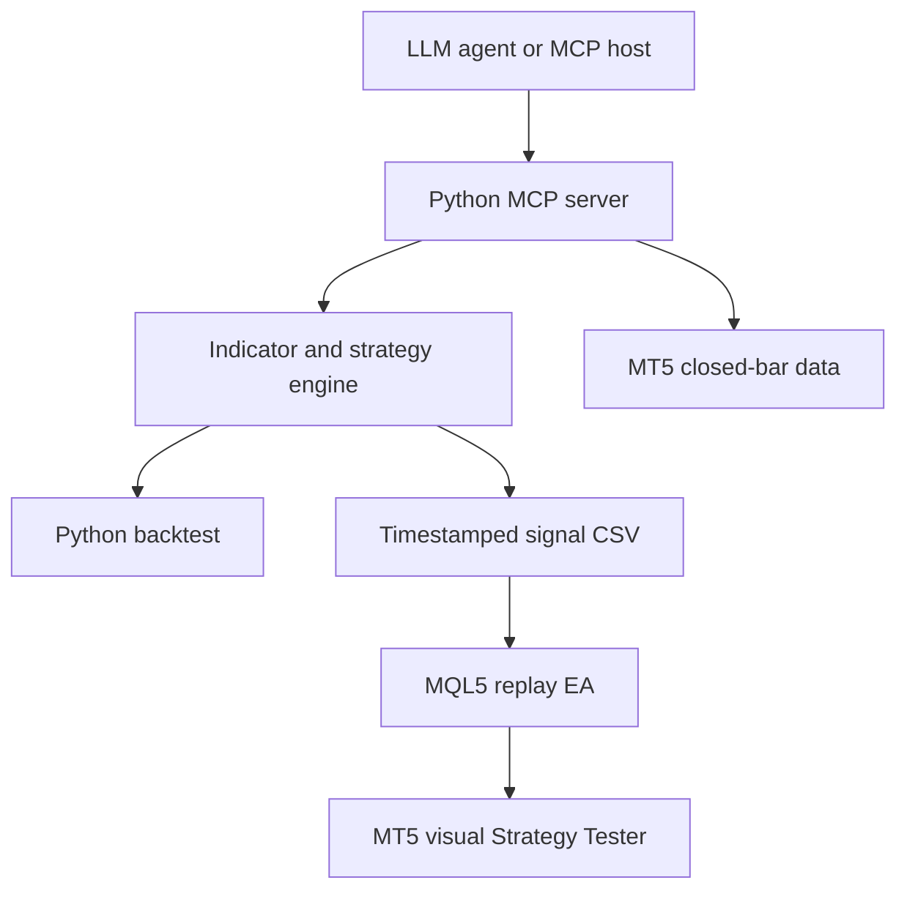

# Agentic Technical-Analysis MCP Server + MetaTrader 5

A runnable Python project for LLM-assisted technical analysis and historical simulation in the MT5 desktop application. Includes real MCP stdio tools, an optional LLM agent, numerical indicators, a cash-equity backtester, and an MQL5 replay Expert Advisor (EA).

**Scope:** agent-assisted research, long/flat rule signals, historical simulation. The EA deliberately runs only in Strategy Tester. The LLM selects analytical tools and explains results; deterministic Python rules produce the replayed trades. This is not a backtest of independent LLM trading decisions. No live brokerage orders are exposed through MCP.

## Architecture



## 1. Install on Windows

Use Windows 64-bit Python 3.11 or 3.12 and an installed MT5 desktop terminal. Sign into a broker demo account in MT5. Stock names and availability depend on your broker; `AAPL` below is a placeholder. Your broker may offer stock CFDs rather than exchange-traded shares. Use the exact Market Watch symbol, including suffixes.

Open PowerShell in this extracted project folder:

```powershell
py -3.12 -m venv .venv
.\.venv\Scripts\python.exe -m pip install -e ".[mt5,agent,dev]"
.\.venv\Scripts\python.exe -m pytest -q
```

All commands below use the virtual environment Python. On macOS/Linux, install `.[agent,dev]` to use CSV analysis and MCP without MT5.

## 2. Run the complete offline smoke test

The bundled dataset is **synthetic**, generated with seed 42. It verifies software behavior, not strategy effectiveness.

```powershell
.\.venv\Scripts\python.exe -m ta_mcp.cli analyze --csv data/SYNTHETIC_H1.csv
.\.venv\Scripts\python.exe -m ta_mcp.cli backtest --csv data/SYNTHETIC_H1.csv --out outputs/backtest.json
```

`backtest.json` contains equity points, individual trades, return, drawdown, and win rate. Sample output is included in `examples/sample-backtest.json`. To regenerate the dataset, run `python examples/make_sample.py` from this folder. Do not replay synthetic signals against a real broker symbol.

## 3. Fetch actual MT5 history

Open the stock chart in MT5 and load its history. Increase MT5's “Max. bars in chart” setting if necessary. Set a terminal path when multiple installations exist:

```powershell
$env:MT5_PATH = "C:\Program Files\MetaTrader 5\terminal64.exe"
.\.venv\Scripts\python.exe -m ta_mcp.cli fetch --symbol AAPL --timeframe H1 --count 5000 --out data/AAPL_H1.csv
.\.venv\Scripts\python.exe -m ta_mcp.cli analyze --csv data/AAPL_H1.csv
.\.venv\Scripts\python.exe -m ta_mcp.cli backtest --csv data/AAPL_H1.csv --out outputs/AAPL-backtest.json
```

The connector reuses the signed-in terminal session. It excludes the forming candle (MT5 bar position 0). CSV timestamps are raw MT5 Unix-second bar-opening values; do not manually apply a timezone offset. The fetch count is a request, not a guarantee: the CLI prints the number actually returned. Supported periods: M5, M15, M30, H1, H4, D1.

## 4. Simulate visually inside MT5

1. Generate the replay from your **broker data**:

   ```powershell
   .\.venv\Scripts\python.exe -m ta_mcp.cli replay --csv data/AAPL_H1.csv --symbol AAPL --timeframe H1 --out outputs/ta_signals.csv
   $common = Join-Path $env:APPDATA "MetaQuotes\Terminal\Common\Files"
   New-Item -ItemType Directory -Force $common | Out-Null
   Copy-Item outputs/ta_signals.csv $common
   ```

   For a nonstandard installation, find `terminal_info().commondata_path` through the MT5 Python package and append `Files`.

2. In MT5 choose **File → Open Data Folder**. Copy `mt5/TAReplay.mq5` into `MQL5/Experts`. Open it in MetaEditor and press **F7** to compile. Resolve any compilation error before continuing. An `.ex5` binary is intentionally not included.
3. Open **View → Strategy Tester** (Ctrl+R). Select `TAReplay`, the exact same symbol and timeframe, and dates **within the exported CSV time range**, including at least one extra bar after the final replay row if you want the EA's end-of-data flattening to run.
4. Select **Every tick based on real ticks**, enable **visual mode**, set initial deposit, and review commission, leverage, and symbol contract settings. Use a **local tester agent**, not the MQL5 cloud or a remote agent; the CSV is in this machine's shared terminal folder.
5. Inputs: `SignalFile=ta_signals.csv`, `RiskPercent=1`, `StopATR=2`, `TakeATR=4`, and an appropriate `MaxLots` for the instrument. Start. Inspect the visual chart, deals, equity, and Journal; save the tester report.

Each CSV row describes the target at a bar opening, based solely on the **previous closed bar**. The exporter uses actual next-bar timestamps, preserving weekend/session gaps. The EA checks symbol and timeframe, only enters once per bar, maintains at most one position per symbol, and closes its position if a row is missing or replay ends. Stops and targets execute through MT5's simulated broker. Re-entry on a later bar is possible while the long target persists after a stop-out.

The signal file is a frozen strategy run. Changing indicators requires regenerating it in Python. MT5 optimization can change EA risk/bracket inputs, but cannot recompute Python indicator parameters. The visual tester displays deals and native chart data; it does not automatically plot Python indicator lines. You can add native RSI, Bands, and Moving Average indicators manually.

## 5. Connect any stdio MCP host

Adapt `examples/mcp-config.json` with **absolute paths**. Start the server through the virtual environment interpreter; no HTTP port is needed.

Tools:

| Tool | Purpose |
|---|---|
| `datasets` | List available CSV files |
| `analyze_csv` | Current indicator values, conditions, long/flat target |
| `evaluate_csv` | Backtest metrics with configurable strategy and costs |
| `analyze_mt5` | Read and analyze closed bars from the local MT5 terminal |

Prompt: “Analyze AAPL_H1.csv. Check indicator agreement, backtest with realistic costs, and explain whether the current rule target is long or flat.”

`TA_DATA_DIR` confines CSV reads to one directory. Do not put private unrelated CSV files there. This is a local stdio server, not an authenticated multi-user service.

## 6. Run the included LLM agent

Set an API key and a tool-capable model available in your API account:

```powershell
$env:OPENAI_API_KEY = "YOUR_API_KEY"
$env:OPENAI_MODEL = "YOUR_TOOL_CAPABLE_MODEL"
$env:TA_DATA_DIR = (Resolve-Path data).Path
.\.venv\Scripts\python.exe -m ta_mcp.agent "Analyze AAPL_H1.csv and evaluate its strategy. Explain conflicting indicators and drawdown." --transcript outputs/agent-transcript.json
```

The agent starts the MCP server, discovers its schemas, lets the LLM call tools, feeds results back, and saves the conversation/tool transcript. Eight tool rounds are allowed by default. `--rounds` changes that limit. An optional `OPENAI_BASE_URL` allows an OpenAI-compatible endpoint. `.env.example` is a template; environment files are not loaded automatically. API calls incur the provider's normal charges.

The LLM's explanation is generated at runtime. Model access and API credentials are required; the shipped example results are deterministic numerical outputs, not a fabricated LLM run.

## Strategy definition

- SMA 20/50 establish trend. EMA 20 is also reported for analysis.
- Supertrend uses Wilder ATR 10 and multiplier 3; its initial direction is bullish at the first valid ATR.
- RSI uses Wilder smoothing with an SMA seed, period 14. Flat-price RSI is defined as 50.
- Bollinger Bands use SMA 20 ± 2 population standard deviations (`ddof=0`).
- Enter when Supertrend is bullish, SMA20 > SMA50, RSI is 50–70 inclusive, and close is strictly between the Bollinger mid and upper band.
- Hold until Supertrend turns bearish, SMA20 < SMA50, or RSI < 45. Stops/targets can exit sooner.
- Fixed brackets at entry: stop 2 ATR, target 4 ATR. ATR comes from the prior candle. No trailing stop.

These are transparent baseline rules, not optimized findings. A parameter example for `evaluate_csv`:

```json
{"name":"AAPL_H1.csv","parameters":{"fast":10,"slow":40,"supertrend_multiplier":2.5},"costs":{"fee_bps":5,"slippage_bps":3,"risk_fraction":0.005}}
```

Use `Strategy(...)` and `Costs(...)` directly in Python for custom runs and `export_replay(..., config=...)` to export the same strategy.

## Interpreting the two simulators

Python models unlevered cash equity in fractional units. Commission and adverse slippage apply on both sides. Risk sizing is capped by cash. Stops take precedence if a candle touches both brackets; existing positions that gap through a stop exit at the opening price. Open positions are liquidated at the last close. Equity drawdown is measured at bar closes, so intrabar drawdown can be larger.

MT5 models its broker's contract sizes, minimum/step volume, margin, spread, ticks, commissions, and execution settings. It uses account-currency stop loss estimates via `OrderCalcProfit` and a configurable lot cap. Tick gaps, spread, lot rounding, stop executions and end-of-test liquidation can produce different trades and returns from Python. Do not describe their results as numerically identical. Neither path handles dividends/splits itself; inspect how your broker's history is adjusted. Stop risk excludes slippage/fees, so realized losses can exceed the requested risk percentage.

For research evaluation, freeze parameters before the holdout period, preserve warmup history, compare against buy-and-hold and simpler MA rules, and report out-of-sample returns, drawdown, trade count, turnover and cost sensitivity. Do not pick a winning configuration on the test interval. No profitability claim is made by this project.

## Validation and remaining environment checks

See `docs/VALIDATION.md`. Python tests cover indicator edge cases, prefix invariance (future rows cannot change earlier signals), next-bar replay alignment, gap stops, ambiguous OHLC brackets, accounting, invalid inputs, path traversal, and actual MCP stdio calls.

Before claiming the entire MT5 integration has been demonstrated, compile the EA and complete the broker-history replay steps on Windows. This package was developed in a Linux environment without a running MT5 terminal or an LLM API credential.

## Sources

- [Official MCP Python SDK](https://github.com/modelcontextprotocol/python-sdk). This package intentionally uses the v1 API and constrains `mcp<2`.
- [MT5 Python integration](https://www.mql5.com/en/docs/python_metatrader5)
- [MT5 copy_rates_from_pos: zero means current bar](https://www.mql5.com/en/docs/python_metatrader5/mt5copyratesfrompos_py)
- [MQL5 FileOpen and FILE_COMMON](https://www.mql5.com/en/docs/files/fileopen)
- [MT5 Strategy Tester and visual testing](https://www.metatrader5.com/en/terminal/help/algotrading/testing)
- [OpenAI Python client](https://github.com/openai/openai-python)
